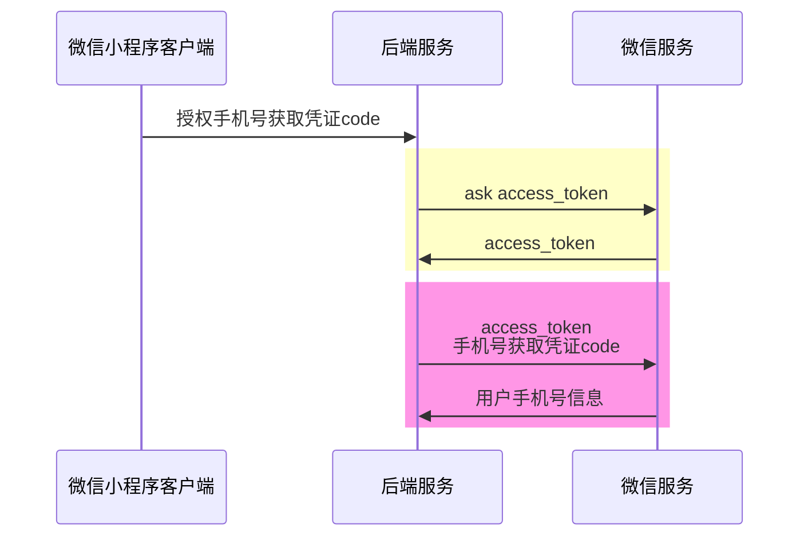

# 主要流程
出于安全的考虑，目前在微信小程序端，是无法直接拿到用户的手机号。需要几步安全校验。整体流程大概是：
1. 在微信后台生成appid & secret
2. 用户登录微信小程序授权访问手机号，获得手机号获取凭证code
3. 调取使用appid & secret，获得接口调用凭证 access_token
4. 使用接口调用凭证 access_token 与手机号获取凭证code调用微信服务获得用户手机号信息
简单讲即：用户授权 & 调用两次微信服务


# 小程序端
使用微信的内置组件 `<button/>`，设置`open-type` 的值设置为 `getPhoneNumber`, 当用户点击并同意之后，通过 `bindgetphonenumber` 事件获取回调信息；
代码如：
```html
<button open-type="getPhoneNumber" bindgetphonenumber="getPhoneNumber"></button>
```

```js
Page({
  getPhoneNumber (e) {
    console.log(e.detail.code)  // 动态令牌
    console.log(e.detail.errMsg) // 回调信息（成功失败都会返回）
    console.log(e.detail.errno)  // 错误码（失败时返回）
  }
})

```

# 获取用户小程序服务端流程如下



# 其他
在开发微信小程序过程中，我们可能需要涉及到以下相关的凭证

| 生成                  | 作用                      | 如何获得                   | 过期时间             | 执行端       |
| ------------------- | ----------------------- | ---------------------- | ---------------- | --------- |
| appid               | 与微信服务交互的凭证              | 管理后台生成                 | 永久               | 微信开发者管理后台 |
| secret              | 与微信服务交互的凭证              | 管理后台生成                 | 永久（如果不在后台重建）     | 微信开发者管理后台 |
| 手机号获取凭证code         | 加密后的手机号                 | 用户授权后可以拿到              | 一次性，被拿去校验成功之后就失效 | 小程序       |
| 接口调用凭据 access token | 用来解密手机号code以此获得手机号      | 通过appid与secret调微信的接口拿到 | 获取2h后失效，期间都可以使用  | 服务端       |
| 登录凭证 code           | 跟微信服务获取openid           | 每次登录的时候                | 一次性，被拿去校验成功之后就失效 | 小程序       |
| openid              | 使用 login code拿到，用户的唯一身份 | 无法直接获取                 | 永久               | 服务端       |

# 参考
- [小程序登录]( https://developers.weixin.qq.com/miniprogram/dev/OpenApiDoc/user-login/code2Session.html)
- [获取接口调用凭据](https://developers.weixin.qq.com/miniprogram/dev/OpenApiDoc/mp-access-token/getAccessToken.html)
- [获取手机号](https://developers.weixin.qq.com/miniprogram/dev/OpenApiDoc/user-info/phone-number/getPhoneNumber.html)