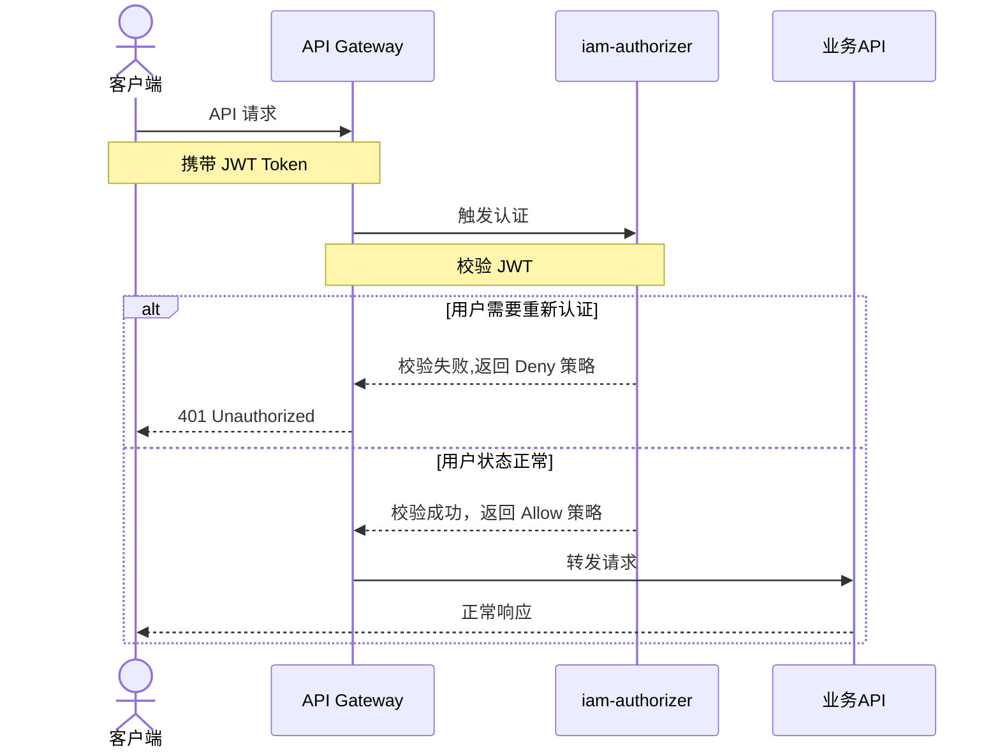
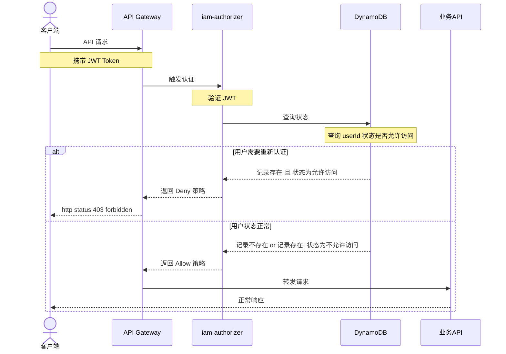
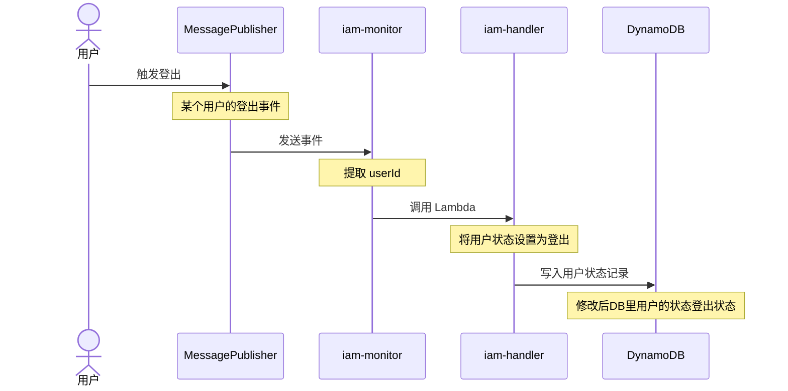
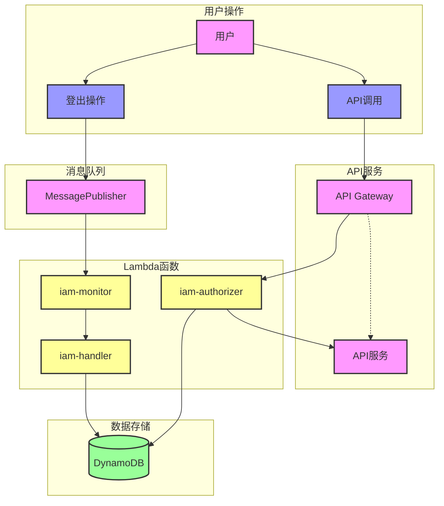

---
tags:
  - AWS
  - Serverless
date: 2025-03-30 21:44:00
title: JWT鉴权也能实现用户登出
description: 本文介绍了使用 JWT鉴权的后台系统，如何实现登出功能。通过引入存储机制，IAM服务端可以对用户的token进行干预，实现强制登出。
---

# 背景
最近在负责的一个后台系统，后台是使用IAM方式来进行用户登录管理的。
而在架构上，该系统使用了aws lambda, api gateway等serverless技术。

接口鉴权的流程大致如下:
1. 用户登录统一管理后台后，由服务端鉴权后下发一个JSON Web Token(后面简称JWT)储存于客户端cookie之中
2. 每次前端调用接口服务时，将cookie的JWT携带上请求后端api(api gateway)
3. api gateway对于每一个请求，都有一个before action来校验JWT是否有效。如果检测有效，则放行，否则响应401，要求用户重新登录

## 鉴权流程图

说明: 这里仅为鉴权流程，不包含用户登录流程，登录流程是独立的，不依赖于鉴权流程

在这套鉴权机制下，有一个重要角色: `iam-authorizer`。它是一个lambda函数，负责校验用户请求header里的JWT是否有效。
1. 如果有效，则放行，让请求回源到后端的API接口
2. 如果JWT失效或者过期，则响应401，让用户重新登录

# JWT的缺陷
使用JWT鉴权的方式，对比cookie-session的模式。有一个很明显的问题：对于下发出去的token，服务端并没有回收或者强制登出的能力。除非token的时间已经过期，否则会一直有效。服务端并不存储用户的session信息，是否有效只能由JWT本身来存储（除非服务端更换鉴权的secret）

这样子一来，就会有一个安全问题，如果用户客户端的token由于保管不妥善被盗取了，在过期前, token都被盗取者能使用。

# 让服务端拥有强制用户登出的能力
上面问题的核心在于：服务端对于某一个下发的token，没有能力去主动让其失效。
那么解决问题的突破点就是：让服务端能够识别具体一个token从而可以去让其失效。借鉴于cookie-session的会话机制，很容易想到，可以服务端保存用户的登录态，然后对登录态进行干涉。

## 引入存储机制

于是，在原来的基础上，引入了存储机制(见下图)。`iam-authorizer`为一个鉴权函数，原本它是需要校验jwt是否有效即可。现在它需要更多的责任，我做了如下改造：
1. 引入了存储服务：dynamoDB，用来管理用户的凭证信息
2. `iam-authorizer`会通过解析JWT获取到用户id，并查询dynamoDB后，如果凭证(isExpired不为true)有效，则放行，否则让用户重新登录

## DynamoDB的表结构

| 字段名 | 字段类型 | 说明 |
| --- | --- | --- |
| userId | String | 用户的ID |
| sessionId | String | 用户的sessionID |
| createdAt | Number | 用户的登录时间 |
| updatedAt | Number | 用户的更新时间 |
| isExpired | Boolean | 用户的登录状态是否过期; 这个字段为本次流程关键，通过干涉这个字段，实现踢出用户 |

## 新鉴权流程
经过改在后，新的鉴权流程如下：

这套机制比开始的机制不同的地方，是引入了存储机制。有了存储机制，问题就好办了，现在只需要干涉数据库里的用户登录状态，就可以让用户的token失效，从而实现强制登出，让用户需要重新登录。

## 强制登出流程的订阅
接下来对了IAM系统进行改造，如果用户登录，则IAM会进行一个登出事件的发布。对于所有的服务，只需要订阅这个登出时间，自行在自己的系统里，对用户踢掉下线。

在非serverless的架构下，如果按照常规的做法，我们需要一个常驻的服务来充当一个subscriber的角色，订阅登出事件并一直监听。

部署一个常驻的服务的成本很高。而我们的应用本身是一个serverless服务。这个时候其实我们更倾向于寻找更加轻便的做法。

我们观察到： 消息队列里，如果消息事件如果没有被消费或者订阅，是会堆积在队列里，等待订阅者消费。
那么，我们可以新增一个函数，作为一个监听者（`iam-monitor`）来监听队列。但是，每一分钟用户都可能在登出，队列随时会推送，那么我们如何保证消息消费的及时性呢？
通过调研，我们发现：
1. aws lambda函数提供最长单个函数15min的执行生命周期 
2. 通过设置定时任务(AWS CloudWatch EventBridge)，定期唤醒函数的形式，设置一定的频率，可以达到类似常驻服务的效果

于是，我们马上设计了一个监听机制:
1. 新增一个监听的角色`iam-monitor`，负责监听用户登出事件
2. 如果监听到用户登出，那么`iam-monitor`会执行处理函数（`iam-handler`），对于登出的用户，在db里将用户的登录状态设置为登出（这样鉴权函数就会识别用户无法登录系统从而让用户重新登录了） 
3. 通过定时任务，每15min 执行一遍`iam-monitor`, 从而达到无缝监听用户登出的效果

登出的流程图如下：

## 完整鉴权流程
至此，后台完整鉴权流程图如下

至此，一个完整的登出流程就设计出来了。

# 总结
1. JWT本身是无状态，但是我们可以通过引入存储的形式。实现对用户态是否有效的干预
2. pub/sub模式，subscriber并不一定需要是一个常驻的服务，只需要定期消费队列的日志即可
